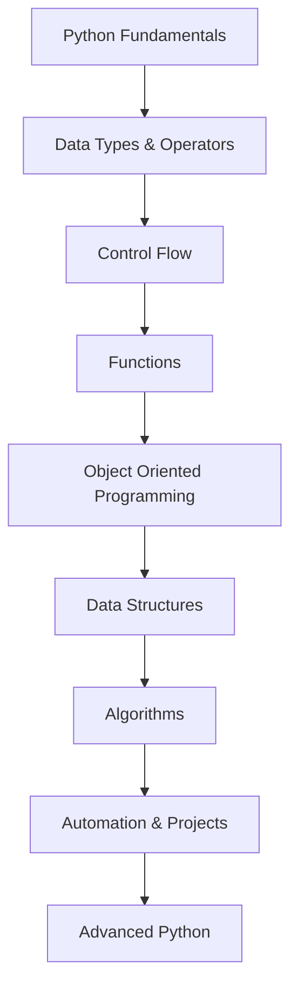
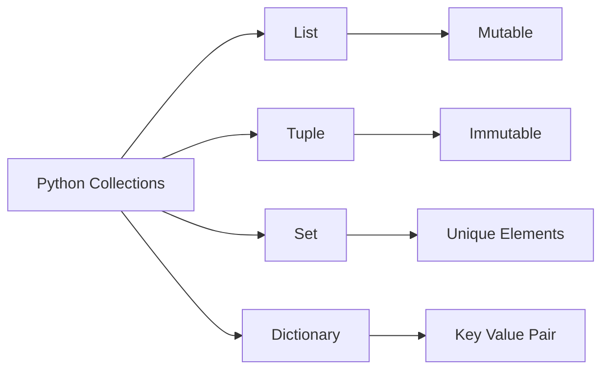

# 🐍 Python Repository


## 📌 Overview

Welcome to my Python repository! This repository contains Python programs, projects, practice problems, and implementations covering fundamental to advanced concepts.

The goal of this repository is to build strong Python programming skills through clean code, problem-solving, automation, and real-world projects.

---

# 📂 Repository Structure

```text
Python-Repository/
│
├── Basics/
│   ├── variables.py
│   ├── data_types.py
│   ├── operators.py
│   └── loops.py
│
├── Functions/
│   ├── functions.py
│   └── recursion.py
│
├── OOP/
│   ├── classes_objects.py
│   ├── inheritance.py
│   └── polymorphism.py
│
├── Data_Structures/
│   ├── lists.py
│   ├── tuples.py
│   ├── dictionaries.py
│   └── sets.py
│
├── Algorithms/
│   ├── searching/
│   ├── sorting/
│   └── recursion/
│
├── Projects/
│   ├── project_1/
│   ├── project_2/
│   └── project_3/
│
├── requirements.txt
├── README.md
└── LICENSE
```

---

# 🏗️ Learning Roadmap



---

# 📚 Topics Covered

## 1. Python Basics

* Variables and Data Types
* Input and Output
* Operators
* Conditional Statements
* Loops
* Pattern Problems

## 2. Functions

* Function Creation
* Parameters and Arguments
* Return Values
* Lambda Functions
* Recursion

## 3. Object-Oriented Programming

Concepts implemented:

```text
Class
 |
 ├── Object
 |
 ├── Encapsulation
 |
 ├── Inheritance
 |
 ├── Polymorphism
 |
 └── Abstraction
```

---

# 🧠 Data Structures Flow



---

Beginner : Python Syntax
        : Basic Programs

Intermediate : OOP Concepts
             : Data Structures
             : Algorithms

Advanced : Automation
         : APIs
         : Machine Learning
         : Real World Projects
```

---

# 🤝 Contribution

Contributions are welcome!

Steps:

1. Fork this repository
2. Create a new branch

```bash
git checkout -b feature-name
```

3. Commit your changes

```bash
git commit -m "Added new feature"
```

4. Push changes

```bash
git push origin feature-name
```

5. Create a Pull Request

---

# 📌 Future Improvements

* Add more Python projects
* Add advanced algorithms
* Include AI/ML projects
* Improve documentation
* Add test cases

---

# 👩‍💻 Author -- sonali yadav

⭐ If you find this repository useful, consider giving it a star!
